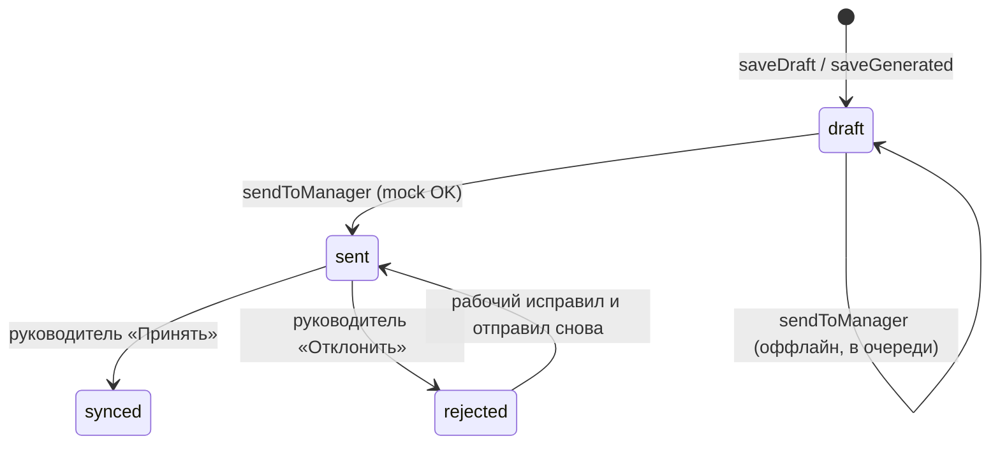

# Структуратор — руководство для разработчика

Документ для второго разработчика (и любого, кто подключается к проекту): что делает приложение, как устроено, где искать код и как всё связано.

**Связанные файлы:** `AGENTS.md` (контракт для AI и дисциплина тестов), `.env.example` (секреты), `pubspec.yaml` (зависимости).

---

## 1. Назначение продукта

**Структуратор** — мобильное Flutter-приложение для хакатона «Пульс Авроры». Оно помогает полевым сотрудникам в условиях нестабильной сети:

1. Зафиксировать наблюдения (текст + фото).
2. При наличии интернета получить от **GigaChat** структурированный markdown-отчёт.
3. Отредактировать результат и отправить руководителю.
4. Руководителю — просмотреть отчёты по рабочим, принять или отклонить с замечаниями.

**Важно:** реального бэкенда нет. Роль «сервера» играет **Mock API** (`MockReportApiService`): задержка, имитация оффлайна (~15%), локальная очередь отправки. Все данные хранятся на устройстве в `shared_preferences` и в файловой системе (фото).

**Ограничения продукта (намеренные):**

- Нет Firebase / Google Services (совместимость с Aurora OS).
- Нет учётных записей с паролем — вход только выбором роли на устройстве.
- Один профиль рабочего на устройство (локальный «текущий» сотрудник).

---

## 2. Роли пользователей

| Роль | Экран после входа | Основные задачи |
|------|-------------------|-----------------|
| **Рабочий** | `WorkerDashboard` | Создание отчётов, черновики, профиль, отправка руководителю |
| **Руководитель** | `ManagerDashboard` | Список рабочих, входящие, шаблоны ИИ, приём/отклонение отчётов |

Вход: `LoginScreen` — две кнопки без пароля. Выбор роли сохраняется в `StorageKeys.userRole`.

---

## 3. Функции по ролям (что видит пользователь)

### 3.1. Рабочий

#### Вход и навигация

- **Выбор роли** «Я Рабочий» → главный экран «Мои отчёты».
- **Выход** — иконка в AppBar, сброс роли.

#### Дашборд отчётов (`WorkerDashboard`)

- Вкладка **«Все»** — полный список отчётов (черновики, на проверке, принятые, отклонённые).
- Вкладка **«Черновики»** — только `ReportStatus.draft`.
- На карточке: тип отчёта, статус, дата, метка «Фото», при отклонении — текст замечаний руководителя.
- **FAB «Новый отчёт»** → экран создания.
- **Аватар в AppBar** → профиль.
- **Ключ GigaChat** — ручной Bearer-токен (если нет `GIGACHAT_AUTH_KEY` в `.env`).

**Открытие отчёта из списка:**

- Черновик или отклонённый → снова `CreateReportScreen` (редактирование и повторная отправка).
- «На проверке» / «Принят» → диалог со статусом (без редактирования).

#### Создание отчёта (`CreateReportScreen`)

| Элемент | Назначение |
|---------|------------|
| Тип отчёта | `Инцидент` / `Метрики` / `Визит к клиенту` — влияет на системный промпт |
| Примеры (чипы) | Готовые короткие тексты из `SampleInputs` (часто требуют фото) |
| Фото | До 5 штук, камера/галерея (`AttachedImagesPanel`) |
| Сырые заметки | Поле ввода; минимум текст **или** фото |
| **Сгенерировать** | Запрос к GigaChat через `GenerationProvider` |
| Результат | Редактируемый `TextField` на весь блок (не статический текст) |
| **Автосохранение** | Черновик пишется в `shared_preferences` через **800 ms** после паузы ввода (как в Telegram); индикатор в AppBar |
| **Отправить руководителю** | Статус `sent` + mock-доставка во входящие руководителя |

После успешной генерации **сырой текст не сохраняется** в персистентном отчёте (`rawText = null`) — только `finalText` и пути к фото.

#### Профиль (`WorkerProfileScreen`)

| Функция | Описание |
|---------|----------|
| ФИО | Редактирование, сохранение в `WorkerProfile` |
| Фото профиля | Камера / галерея / удаление |
| Статистика | Всего, отправлено, черновики, принято, отклонено |
| Список черновиков | Быстрый переход к редактированию |

ФИО из профиля записывается в поле `Report.workerName` при каждом сохранении/отправке.

---

### 3.2. Руководитель

#### Дашборд (`ManagerDashboard`)

Три вкладки в нижней навигации:

1. **Рабочие** (`WorkersScreen`)
2. **Входящие** (`InboxScreen`)
3. **Шаблоны** (`TemplatesScreen`)

При первом входе руководителя вызывается `ReportProvider.init(seedManagerMock: true)` — подмешиваются демо-отчёты (`MockInboxSeeder`).

#### Рабочие

- Список агрегирован по `workerName` из входящих (`WorkerSummary`).
- Для каждого: число отчётов, бейдж «на проверке», дата последнего отчёта.
- Тап → `WorkerReportsScreen` — все отчёты этого ФИО.

#### Входящие

- Хронологический список всех отчётов во входящих.
- Тап → `ReportReviewScreen`.

#### Проверка отчёта (`ReportReviewScreen`)

| Действие | Результат |
|----------|-----------|
| **Принять отчёт** | `ReportStatus.synced` у записи во входящих и у рабочего (по `id`) |
| **Отклонить с замечаниями** | `ReportStatus.rejected` + поле `managerFeedback`; рабочий видит текст в списке |

Принять/отклонить доступно только для статуса **«На проверке»** (`sent`).

#### Шаблоны ИИ (`TemplatesScreen`)

- CRUD шаблонов: название, тип отчёта (опционально), текст инструкции для модели.
- При генерации у рабочего в системный промпт подмешивается шаблон для выбранного типа (`TemplateProvider.instructionForType` + `ReportPrompts.buildSystemPrompt`).

---

## 4. Жизненный цикл отчёта



| Статус | ID | Подпись в UI | Кто видит |
|--------|-----|--------------|-----------|
| Черновик | `draft` | Серый | Рабочий |
| На проверке | `sent` | Оранжевый | Рабочий + руководитель |
| Принят | `synced` | Зелёный | Обе стороны |
| Отклонён | `rejected` | Красный | Обе стороны (+ `managerFeedback`) |

**Два хранилища отчётов:**

- `reports_v2` — отчёты рабочего на этом устройстве.
- `manager_inbox_v1` — копии отправленных отчётов у «руководителя» (на том же устройстве при смене роли).

Синхронизация статуса при проверке: `ReportProvider._setReviewStatus` обновляет оба списка по одному `id`.

---

## 5. Интеграция с GigaChat

### 5.1. Конфигурация

| Источник | Переменные |
|----------|------------|
| `.env` | `GIGACHAT_AUTH_KEY`, `GIGACHAT_SCOPE`, `GIGACHAT_MODEL` |
| `lib/config/env.dart` | Фасад `Env.*`, загрузка при старте |
| `lib/config/api_config.dart` | URL, таймауты, лимит фото, базовый system prompt |

Ручной токен (опционально): `StorageKeys.manualToken` — вводится с экрана рабочего, приоритетнее OAuth.

### 5.2. Сервис `GigaChatService` (`HttpGigaChatService`)

| Метод | Назначение |
|-------|------------|
| `obtainAccessToken` | OAuth2 по `GIGACHAT_AUTH_KEY` |
| `generateReport` | Chat Completions: текст + опционально фото (загрузка в `/api/v1/files`) |
| | Параметр `systemPrompt` — тип отчёта + шаблон руководителя + анти-галлюцинации |

### 5.3. Валидация ввода (`InputValidator`)

Перед каждым сетевым вызовом:

- длина 10–8000 символов (если есть текст);
- удаление control-символов;
- логирование подозрений на prompt-injection (без блокировки всего сообщения).

### 5.4. FSM генерации (`GenerationProvider`)

| Состояние | UI |
|-----------|-----|
| `empty` | «Результат появится здесь» |
| `loading` | Спиннер |
| `error` | Карточка с текстом ошибки |
| `success` | Редактируемое поле + кнопки черновик/отправка |

---

## 6. Архитектура кода

```
lib/
├── main.dart                 # Composition root, MultiProvider, маршрутизация по роли
├── config/
│   ├── api_config.dart       # URL, таймауты, лимиты
│   ├── env.dart              # .env
│   ├── app_theme.dart        # Material 3 light/dark
│   ├── storage_keys.dart     # Ключи SharedPreferences
│   ├── report_prompts.dart   # Сборка system prompt по типу/шаблону/фото
│   └── sample_inputs.dart    # Примеры для рабочего
├── models/
│   ├── report.dart
│   ├── report_status.dart / report_type.dart
│   ├── report_template.dart
│   ├── user_role.dart
│   ├── worker_profile.dart
│   ├── worker_summary.dart      # Агрегат для списка рабочих
│   └── worker_report_stats.dart # Счётчики для профиля
├── services/
│   ├── storage_service.dart       # abstract + SharedPrefsStorageService
│   ├── giga_chat_service.dart
│   ├── mock_report_api_service.dart
│   └── image_storage_service.dart # Файлы в documents/report_images/
├── providers/
│   ├── auth_provider.dart
│   ├── worker_profile_provider.dart
│   ├── report_provider.dart
│   ├── template_provider.dart
│   └── generation_provider.dart
├── screens/
│   ├── login_screen.dart
│   ├── worker/   # dashboard, create_report, profile
│   └── manager/  # dashboard, workers, inbox, review, templates
├── widgets/      # profile_avatar, report_chips
└── utils/        # app_logger, input_validator, ui_feedback, app_navigation
```

**Правило слоёв:** экраны не вызывают `http` и `SharedPreferences` напрямую — только провайдеры и сервисы. DI только в `main.dart`.

---

## 7. Провайдеры (API для UI)

### `AuthProvider`

- `init()`, `login(UserRole)`, `logout()`
- `isLoggedIn`, `role`

### `WorkerProfileProvider`

- `init()` — загрузка/создание профиля
- `updateFullName`, `setPhotoFromFile`, `clearPhoto`, `photoFile()`
- `profile` — `WorkerProfile`

### `ReportProvider`

| Геттер / метод | Назначение |
|----------------|------------|
| `workerReports`, `drafts`, `sentReports`, `rejectedReports` | Списки |
| `workerStats` | `WorkerReportStats` для профиля |
| `managerInbox`, `workerSummaries` | Для руководителя |
| `reportsForWorker(name)` | Отчёты одного ФИО |
| `upsertDraft` | Автосохранение: create/update по `existingId` |
| `saveDraft`, `saveGenerated` | Требуют `workerName` |
| `sendToManager(id)` | Mock API + очередь |
| `acceptReport` / `rejectReport` | Проверка руководителем |
| `ensureToken()` | OAuth или manual token |
| `setManualToken` | Ручной Bearer |

### `TemplateProvider`

- `templates`, `templateForType`, `instructionForType`
- `upsert`, `remove`

### `GenerationProvider`

- `generate(rawText, tokenResolver, imageFiles, systemPrompt)`
- `reset()`, `status`, `result`, `error`

---

## 8. Локальное хранилище

| Ключ (`StorageKeys`) | Содержимое |
|----------------------|------------|
| `reports_v2` | JSON-массив `Report` рабочего |
| `manager_inbox_v1` | JSON-массив входящих руководителя |
| `user_role_v1` | `worker` / `manager` |
| `worker_profile_v1` | `WorkerProfile` |
| `templates_v1` | Шаблоны ИИ |
| `send_queue_v1` | ID отчётов, ожидающих mock-отправки |
| `gigachat_manual_token_v1` | Ручной токен |
| `mock_inbox_seeded_v1` | Флаг демо-данных |

Фото отчётов и аватар: каталог `report_images/` через `ImageStorageService` (имена файлов — UUID в JSON).

---

## 9. Mock API и оффлайн

`HttpMockReportApiService`:

1. Задержка ~600 ms.
2. С вероятностью ~15% — «нет сети»: ID в `send_queue`, `sendToManager` возвращает `false`, у рабочего статус остаётся `draft`.
3. При успехе — копия отчёта в `manager_inbox` со статусом `sent`.
4. `syncPending()` при `ReportProvider.init()` — повторная отправка из очереди.

`MockInboxSeeder` — два демо-отчёта (Иванов А.П., Петрова М.К.) при первом входе руководителя.

---

## 10. Безопасность и приватность

- Секреты только в `.env` (не в git).
- HTTPS; ослабление проверки сертификата **только** в `kDebugMode` (`main.dart`, `_DevHttpOverrides`).
- После успешной генерации сырой текст не персистится.
- Ошибки логируются через `AppLogger`, пустых `catch (_) {}` нет.
- `BuildContext` после `async` — проверка `mounted` на экранах.

---

## 11. Сборка и запуск

### Требования

- Flutter SDK ≥ 3.19, Dart ≥ 3.3
- Android: разрешения камеры/галереи в манифесте
- Windows: для `path_provider` / symlinks может понадобиться **Developer Mode**

### Первый запуск

```bash
cd D:\AuoraHacaton   # путь к корню репозитория
cp .env.example .env # или copy на Windows
# Заполнить GIGACHAT_AUTH_KEY в .env

flutter pub get
flutter run --dart-define=ENABLE_LOGGING=true
```

### Тесты

```bash
flutter test                    # все unit + acceptance
flutter test test/acceptance/   # только UX-сценарии
flutter analyze
flutter test integration_test/app_smoke_test.dart  # на устройстве/эмуляторе
```

### Известные нюансы Windows

- Проект на `D:`, pub cache на `C:` — в `android/gradle.properties` отключён Kotlin incremental (`kotlin.incremental=false`).
- Зеркало Flutter (если медленно): `FLUTTER_STORAGE_BASE_URL=https://storage.flutter-io.cn`.

---

## 12. Тесты (кратко)

| Каталог | Что проверяет |
|---------|----------------|
| `test/unit/` | Модели, провайдеры, сервисы, валидатор |
| `test/acceptance/` | Сценарии «When user … then …» |
| `test/helpers/fakes.dart` | In-memory `StorageService`, `FakeGigaChatService` |
| `test/helpers/test_app.dart` | `pumpStructurator()` — подъём `WorkerDashboard` с фейками |
| `integration_test/` | Холодный старт, экран входа |

Перед фичей по дисциплине проекта: failing acceptance → unit → реализация → refactor (`AGENTS.md`).

---

## 13. Карта экранов (быстрый поиск)

| Файл | Роль |
|------|------|
| `login_screen.dart` | Вход |
| `worker/worker_dashboard.dart` | Список отчётов, вкладки |
| `worker/create_report_screen.dart` | Создание / редактирование |
| `worker/worker_profile_screen.dart` | ФИО, фото, статистика, черновики |
| `manager/manager_dashboard.dart` | Оболочка с 3 вкладками |
| `manager/workers_screen.dart` | Список рабочих |
| `manager/worker_reports_screen.dart` | Отчёты одного рабочего |
| `manager/report_review_screen.dart` | Принять / отклонить |
| `manager/inbox_screen.dart` | Все входящие |
| `manager/templates_screen.dart` | Шаблоны ИИ |

---

## 14. Типичные задачи для доработки

| Задача | Куда смотреть |
|--------|----------------|
| Новый тип отчёта | `ReportType`, `report_prompts.dart`, шаблон по умолчанию в `TemplateProvider` |
| Новый статус | `ReportStatus`, UI чипы, `_setReviewStatus`, тесты JSON |
| Реальный бэкенд вместо mock | Заменить `MockReportApiService`, синхронизация двух списков |
| Несколько рабочих на устройстве | Расширить `WorkerProfile` + привязка `report.workerId` |
| Push-уведомления руководителю | Вне scope (нет FCM); нужен свой канал |
| Улучшить промпт | `report_prompts.dart`, `ApiConfig.reportSystemPrompt` |

---

## 15. Модель `Report` (поля)

| Поле | Тип | Описание |
|------|-----|----------|
| `id` | `String` | UUID |
| `rawText` | `String?` | Сырые заметки (только черновики / до генерации) |
| `finalText` | `String?` | Структурированный markdown |
| `type` | `ReportType` | incident / metrics / client_visit |
| `status` | `ReportStatus` | draft / sent / synced / rejected |
| `createdAt` | `DateTime` | Время создания |
| `imagePaths` | `List<String>` | Имена файлов фото |
| `workerName` | `String` | ФИО из профиля |
| `templateId` | `String?` | Какой шаблон использовался |
| `managerFeedback` | `String?` | Замечания при отклонении |

Геттеры: `title` (первая строка без markdown), `isDraft`, `hasStructured`, `hasImages`.

---

## 16. Промпты GigaChat и автосохранение

| Файл | Назначение |
|------|------------|
| `lib/config/report_prompts.dart` | Полный system prompt: роль, структура по типу, шаблон руководителя, правила с/без фото |
| `lib/utils/draft_autosave.dart` | Debounce-таймер автосохранения |
| `ReportProvider.upsertDraft` | Единая точка записи черновика |

Промпт различает режим **с фото** (модель может описать снимки) и **только текст** (раздел «Фотофиксация» без выдуманных деталей).

Подробный roadmap инструментов для качества отчётов — **`docs/TOOLS_ROADMAP.md`**.

---

## 17. Контакты по проекту

- Хакатон: «Пульс Авроры», оффлайн-first MVP.
- Имя пакета: `structurator` (`pubspec.yaml`).
- Android application id: `com.example.structurator` (см. `android/app/`).

При вопросах по архитектурным запретам и стилю — сначала `AGENTS.md` и `.cursor/rules/`.

---

*Документ актуален для версии 1.0.0+1. При добавлении экранов или провайдеров обновляйте разделы 3, 6, 13.*
